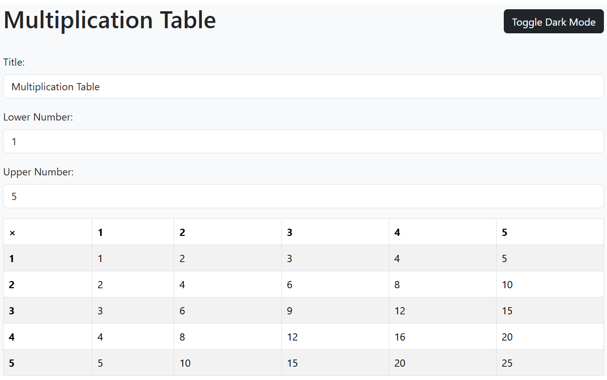

# Assignment: Multiplication Table

## Introduction

In this assignment, you'll create a multiplication table using React components. This will require working with components, state management, and passing props between components.

### Starter Code

Start a new project for this assignment.

## Requirements

### Outer Component (TableContainer)

Create a component that manages:

- A title for the table (using useState, default to "Multiplication Table")
- A lower bound (using useState, default to 1)
- An upper bound  (using useState, default to 10)

Include input fields for:

- Changing the title.
- Setting the lower bound.
- Setting the upper bound.

Pass the lower and upper bounds to the inner component as props

### Inner Component (MultiplicationTable)

Create a component that receives the lower and upper bounds.

1. Use nested loops to create the multiplication table
2. Display the table using proper HTML table tags (table, tr, td)

### Styling Requirements

Add Bootstrap 5 CDN to your index.html file and style the components using the form-control, table, and other classes. The resulting app must be responsive! 

Also, use a context hook to add theming to the application and set styles for light and dark mode.

## Conclusion

This application allowed us to practice managing state, context, and props passing. These are key "components" (see what we did there?) to building professional React applications!
